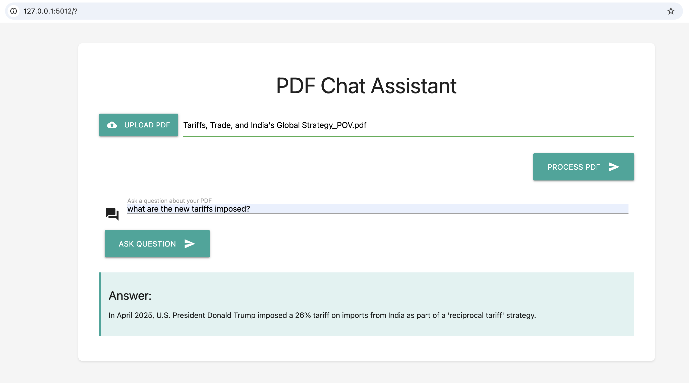

# PDF Chat Assistant

A modern web application that allows users to upload PDF documents and interact with them through natural language queries using OpenAI's GPT model. Built with Flask and Material Design, this application provides an intuitive interface for extracting information from PDF documents.

## Demo



The application provides a clean, intuitive interface for uploading PDFs and asking questions about their content. The AI-powered assistant provides accurate, context-aware responses based on the document content.

## Features

- 📤 Modern, Material Design interface for PDF uploads
- 💬 Interactive chat-like interface for querying PDF content
- 🔍 Intelligent text extraction from PDF documents
- 🤖 AI-powered responses using OpenAI's GPT model
- 🎨 Responsive and user-friendly design
- 📱 Mobile-friendly interface

## Technology Stack

- **Backend**: Python, Flask
- **Frontend**: Material Design, JavaScript
- **PDF Processing**: PyPDF2
- **AI Model**: OpenAI GPT-3.5 Turbo
- **Styling**: Materialize CSS

## Project Structure

```
pdfqna/
├── templates/         # HTML templates
│   └── index.html     # Main application interface
├── uploads/           # Directory for uploaded PDFs (gitignored)
├── upload_and_extract.py  # Main application file
├── requirements.txt   # Python dependencies
├── .env              # Environment variables (gitignored)
└── README.md         # Project documentation
```

## Setup Instructions

1. **Clone the repository**
   ```bash
   git clone https://github.com/vikasums/pdfqna.git
   cd pdfqna
   ```

2. **Set up environment variables**
   ```bash
   cp .env.example .env
   # Edit .env and add your OpenAI API key
   ```

3. **Install dependencies**
   ```bash
   pip install -r requirements.txt
   ```

4. **Run the application**
   ```bash
   python upload_and_extract.py
   ```

## Usage

1. Access the application through your web browser (default: http://localhost:5012)
2. Click the "Upload PDF" button to select and upload your PDF document
3. Once uploaded, use the query interface to ask questions about the PDF content
4. Receive AI-generated responses based on the content of your PDF

## Environment Variables

Create a `.env` file in the project root with the following variables:

```env
OPENAI_API_KEY=your_api_key_here
```

## Contributing

Contributions are welcome! Please feel free to submit a Pull Request.

## License

This project is licensed under the MIT License - see the LICENSE file for details.

## Acknowledgments

- [OpenAI](https://openai.com/) for providing the GPT API
- [Materialize](https://materializecss.com/) for the beautiful Material Design components
- [Flask](https://flask.palletsprojects.com/) for the web framework

